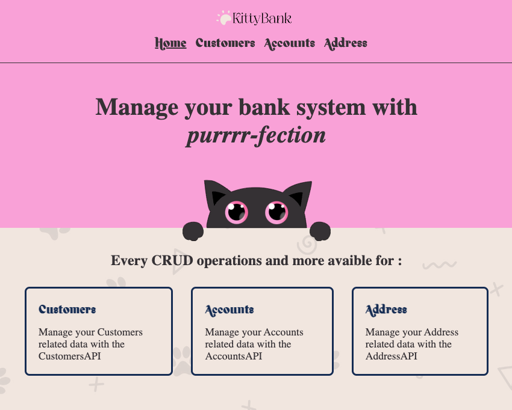

# KittyBank

Manage your bank system with purrrr-fection, this is the promise of KittyBank. With its performing API, you'll be able to easely manage your data, regarding of your customers, their accounts and their address. 

## Home Page 

With its cute and refreshing design, KittyBank will help you work easely and with the happiness of a purring cat ! 

## Customers API

> - List all your customers 
> - Search a customer with its ID 
> - Add a new Customer (Link to Form page)
> - Update a customer's informations (Link to Form page)
> - Delete a Customer and all its related data (address, accounts)

### Customer Form 

> - Add a new Customer. City and Province are automatically saved with the provided postal code 
> - Update informations of existing Customer. Existing data automatically fulfilled. You can update customer's name, adress' city, postal code and province

## Accounts API 

> - List all accounts 
> - Search all account of a specific customer with its ID 
> - Add a new Account (Link to Form Page)
> - Update an Account's informations (Link to Form page)
> - Delete an account 

### Account Form

> - Add a new Account. Customer ID are comming from all existing ID, so no wrong ID can be provided
> - Update informations of existing Account. Existing data automatically fulfilled. You can update Account's Balance, and Interest Rate in the case of a Savings Accounts.

## Address API 

*Not yet implemented, but will work the same way as the two others API with all CRUD operations available*
